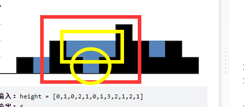
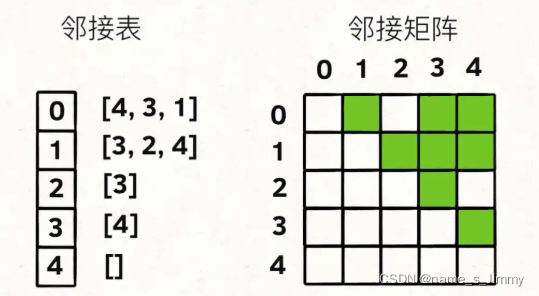
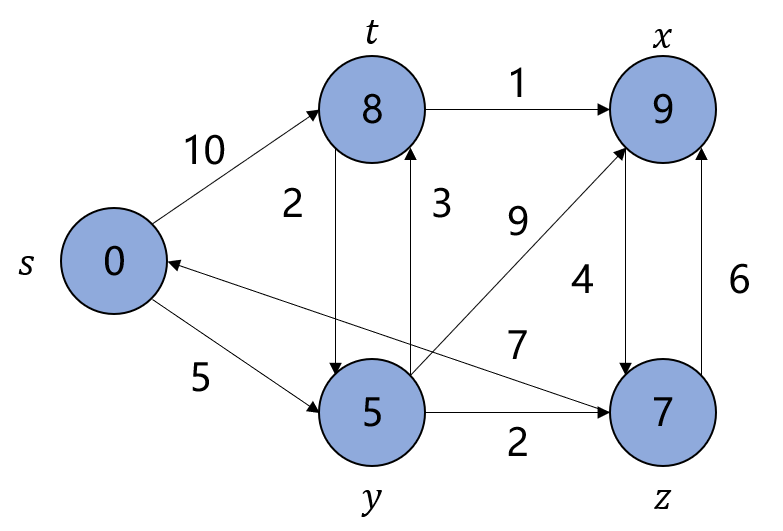

# Hot100

## 深度优先搜索

### [200（岛屿数量）](https://leetcode.cn/problems/number-of-islands/)

**思路**：遍历所有方格，遇到“1”则进入dfs函数。退出dfs的时候说明找到了一个岛屿，结果+1。**在写dfs的时候有几点需要考虑**：1.返回值；2.传入的参数；3.什么时候退出dfs。

对于这个dfs的返回值，因为每个dfs函数之间没有联系（比如逻辑与非，或者递增递减），返回void就好。

对于传入的参数，**我们可以在传进来的时候进行移位计算，这样当某一次dfs return的时候，我们可以不需要对位置进行还原。**因为需要移位操作，所以肯定需要传入行列，还有网格图的引用。**还有一点就是，为了防止我们在两个相邻的网格间反复横跳，我们需要用一个visited来记录我们已经走过的网格**。这里不是像回溯一样，走了之后如果遇到0了要后退，那么有一些步骤就需要还原。这里不需要还原，因为我们只要走到了，以后就一定不需要在走这个位置了，我们不是在找一条路径，我们是在找一个连在一起的整体。这题我们可以直接改动网格图，走到“1”，就把“1”改成“0”。

什么时候退出dfs呢？超出网格图范围的时候；遇到“0”的时候，这次dfs就应该结束。

最终代码如下：

```c++
class Solution {
private:
    int row;
    int col;
    vector<int> lat = {1, 0, -1, 0};
    vector<int> lon = {0, 1, 0, -1};
    void dfs(int r, int c,vector<vector<char>>& grid)
    {
        if (r < 0 || r >= row || c < 0 || c >= col || grid[r][c]=='0')
        {
            return;
        }
        grid[r][c] = '0';
        for (int i = 0; i < 4; ++i)
        {
            dfs(r + lon[i], c + lat[i],grid);
        }
    }
public:
    int numIslands(vector<vector<char>>& grid) {
        row = grid.size();
        col = grid[0].size();
        int res = 0;
        for (int i = 0; i < row; ++i)
        {
            for (int j = 0; j < col;++j)
            {
                if(grid[i][j]=='1')
                {
                    dfs(i, j, grid);
                    res++;
                }
            }
        }
        return res;
    }
};
```

对于上下左右的探索，以后均用两个vector来进行。

### [463（岛屿周长）](https://leetcode.cn/problems/island-perimeter/submissions/)

**思路**：妈的，这题一看居然想着用1的个数去减重复的边。非常的愚蠢，因为你要计算重复的边，很麻烦，想不通。应该换一个角度，直接从0开始去累加边长，遇到海水或者边界就＋1，遇到陆地就不会产生周长，并且标记已经走过。代码和 **岛屿数量那题类似**。

```c++
class Solution {
    constexpr static int dx[4] = {0, 1, 0, -1};
    constexpr static int dy[4] = {1, 0, -1, 0};
public:
    int dfs(int x, int y, vector<vector<int>> &grid, int n, int m) {
        if (x < 0 || x >= n || y < 0 || y >= m || grid[x][y] == 0) {
            return 1;
        }
        if (grid[x][y] == 2) {
            return 0;
        }
        grid[x][y] = 2;
        int res = 0;
        for (int i = 0; i < 4; ++i) {
            int tx = x + dx[i];
            int ty = y + dy[i];
            res += dfs(tx, ty, grid, n, m);
        }
        return res;
    }
    int islandPerimeter(vector<vector<int>> &grid) {
        int n = grid.size(), m = grid[0].size();
        int ans = 0;
        for (int i = 0; i < n; ++i) {
            for (int j = 0; j < m; ++j) {
                if (grid[i][j] == 1) {
                    ans = dfs(i, j, grid, n, m);
                }
            }
        }
        return ans;
    }
};

```

### [695（最大岛屿面积）](https://leetcode.cn/problems/max-area-of-island/submissions/)

**思路**：这题比较简单，记录每一个大dfs的面积，然后选出最大的。 **返回值写成bool型可以方便加减**。这种有点递归的思想，算到最底层，然后从底层的1开始往上累加，res是在每一个新岛屿的时候才会更新。（你要么写成成员变量，要么写成传入参数，让他在每一次dfs中变化）

```c++
class Solution {
private:
    int row;
    int col;
    vector<int> lat = {1, 0, -1, 0};
    vector<int> lon = {0, 1, 0, -1};
    int res = 1;
    bool dfs(int r, int c, vector<vector<int>> &grid)
    {
        if (r < 0 || r >= row || c < 0 || c >= col||grid[r][c]==0)
        {
            return false;
        }
        grid[r][c] = 0;
        for (int i = 0; i < 4; ++i)
        {
            res += dfs(r + lon[i], c + lat[i], grid);
        }
        return true;
    }

public:
    int maxAreaOfIsland(vector<vector<int>>& grid) {
        row = grid.size();
        col = grid[0].size();
        int ans = 0;
        for (int i = 0; i < row; ++i)
        {
            for (int j = 0; j < col;++j)
            {
                if(grid[i][j]==1)
                {
                    res = 1;
                    dfs(i, j, grid);
                    ans=max(ans,res);
                }
            }
        }
        return ans;
    }
};
```

### [207（课程表）](https://leetcode.cn/problems/course-schedule/)

**思路**：这是一道拓扑排序题，每门课程之间有箭头，如果a是b的前提，那么箭头从b指向a。按照这种思路，当我们找到一个课程，发现他没有箭头指向别的课程，就说明这个课程是最基础的了，不用提前学其他课程了，这个课程是可以完成的，那么给这个课程标记2。当一个课程指向的其他前提课程都被标记成2时，该课程也可以标记成2。在搜索某一课程的前提课程时，这个课程要被标记成1，说明还不能确定，这个课程能不能学习，如果此时搜索到一个被标记为1的前提课程，说明产生了 **环**，那就说明课程无法全部完成学习了。

**注意**：首先要遍历，建立拓扑图；要注意当出现环的时候直接跳出dfs，要连续跳出，而不是当前dfs跳出，然后还回到上一层继续搜索。

```c++
class Solution {
private:
    vector<vector<int>> edges;
    vector<int> visited;
    bool valid = true;

public:
    void dfs(int u) {
        visited[u] = 1;
        for (int v: edges[u]) {
            if (visited[v] == 0) {
                dfs(v);
                if (!valid) {//直接判断，进行跳出
                    return;
                }
            }
            else if (visited[v] == 1) {
                valid = false;
                return;
            }
        }
        visited[u] = 2;
    }

    bool canFinish(int numCourses, vector<vector<int>>& prerequisites) {
        edges.resize(numCourses);
        visited.resize(numCourses);
        for (const auto& info: prerequisites) {
            edges[info[1]].push_back(info[0]);
        }
        for (int i = 0; i < numCourses && valid; ++i) {
            if (!visited[i]) {
                dfs(i);
            }
        }
        return valid;
    }
};

```

### [210（课程表2）](https://leetcode.cn/problems/course-schedule-ii/)

**思路**：和上面的一样，但是需要用一个栈存储课程，记住第一个放进去的是级别最高的课程，所以得到答案之后应该进行翻转。

```c++
class Solution {
private:
    // 存储有向图
    vector<vector<int>> edges;
    // 标记每个节点的状态：0=未搜索，1=搜索中，2=已完成
    vector<int> visited;
    // 用数组来模拟栈，下标 0 为栈底，n-1 为栈顶
    vector<int> result;
    // 判断有向图中是否有环
    bool valid = true;

public:
    void dfs(int u) {
        // 将节点标记为「搜索中」
        visited[u] = 1;
        // 搜索其相邻节点
        // 只要发现有环，立刻停止搜索
        for (int v: edges[u]) {
            // 如果「未搜索」那么搜索相邻节点
            if (visited[v] == 0) {
                dfs(v);
                if (!valid) {
                    return;
                }
            }
            // 如果「搜索中」说明找到了环
            else if (visited[v] == 1) {
                valid = false;
                return;
            }
        }
        // 将节点标记为「已完成」
        visited[u] = 2;
        // 将节点入栈
        result.push_back(u);
    }

    vector<int> findOrder(int numCourses, vector<vector<int>>& prerequisites) {
        edges.resize(numCourses);
        visited.resize(numCourses);
        for (const auto& info: prerequisites) {
            edges[info[1]].push_back(info[0]);
        }
        // 每次挑选一个「未搜索」的节点，开始进行深度优先搜索
        for (int i = 0; i < numCourses && valid; ++i) {
            if (!visited[i]) {
                dfs(i);
            }
        }
        if (!valid) {
            return {};
        }
        // 如果没有环，那么就有拓扑排序
        // 注意下标 0 为栈底，因此需要将数组反序输出
        reverse(result.begin(), result.end());
        return result;
    }
};
```

### [337（打家劫舍3）](https://leetcode.cn/problems/house-robber-iii/solution/san-chong-fang-fa-jie-jue-shu-xing-dong-tai-gui-hu/)

**思路**：有很多这种类似的题目就是到一个节点有两个状态，你当前状态的选择会影响后面的选择。是不是有点类似背包问题？你是装还是不装呢？为了避免重复计算，**一般会选择两个容器把两种状态的数据存储起来**， 应该想到动态规划。但是为什么把他放在dfs里呢？因为二叉树需要dfs来遍历，这里有点动态规划作为思想，dfs作为工具的意思？（后面理解深刻了再来更正）。**写动态规划**

**第一应该去从结果上进行拼接，因为 $f(x)=2*f(x-1)+2$这种公式都是在对结果进行操作，而不应该从 $f(x)$的实现上去考虑问题**

**第二应该定义好 $f(x)$的意义**

**动态规划递推方程**：

如果**当前节点进行打劫**，那么这种情况能打到的最大值等于 **左子节点和右子节点不进行打劫之和**

如果 **当前节点不进行打劫**，那么子节点有两种选择，打劫和不打劫，所以最大值等于 **（打劫左子节点和不打劫左子节点）的较大值+（打劫右子节点和不打劫右子节点）的较大值**

```c++
class Solution {
    unordered_map<TreeNode *, int> f, g;
    void dfs(TreeNode *root)
    {
        if (!root)
        {
            return;
        }
        dfs(root->left);
        dfs(root->right);
        f[root] = root->val+g[root->left]+g[root->right];
        g[root] = max(f[root->left] + f[root->right], g[root->left] + g[root->right]);
    }

public:
    int rob(TreeNode* root) {
        return max(f[root], g[root]);
    }
};
```

### [437（路径总和3）](https://leetcode.cn/problems/path-sum-iii/)

**思路**：这题仔细一看思路好像很简单，固定一个根节点如何去找路径和等于target的路径，如何遍历所有节点，把路径数量相加。遍历节点很简单，但是怎么找路径呢？走到底又退回去，那么路径和又要减去node值吗？**如果你从回溯的角度去思考的话就犯了上一题同样的问题了，我们应该善于从结果的角度去思考，建立父节点和他的左右子树的关系，而不是和左右子节点的关系**。

关系：当前节点的路径=左右子树寻找target-父节点value的路径和。

这样这个问题就很好解决了，还有细节要注意 **node_val的范围，在加减的时候可能会溢出**

```c++
 */
class Solution {
private:
    int res = 0;
    int rootSum(TreeNode *root, long long targetSum)
    {
        if(!root)
        {
            return 0;
        }
        int ret = 0;
        if(root->val==targetSum)
        {
            ret++;
        }
        ret += rootSum(root->left, targetSum - root->val);
        ret += rootSum(root->right, targetSum - root->val);
        return ret;
    }

public:
    int pathSum(TreeNode* root, int targetSum) {
        if(!root)
        {
            return 0;
        }
        res += rootSum(root, targetSum);
        pathSum(root->left, targetSum);
        pathSum(root->right, targetSum);
        return res;
    }
};
```

## 前缀和

### [560（和为k的子数组）](https://leetcode.cn/problems/subarray-sum-equals-k/submissions/)

**思路**：上面那题路径总和3其实也可以用前缀和去做，**前缀和就是典型的空间换时间，因为前缀和需要首尾两个指针来组成一个区间，一个指针由遍历产生，另一个一般可以有hash表查找得到，这样可以降低时间复杂度**。本题需要想办法在一个循环里完成前缀和表的生产与查找，如果你生成好了再去查，那遍历的时候还需要不断更新维护前缀和表（自己的代码一开始就是这样，遍历的时候还要防止选到前面的值，会导致**左右边界反了**）。

```c++
class Solution {
public:
    int subarraySum(vector<int>& nums, int k) {
        unordered_map<int, int> mp;
        mp[0] = 1;
        int count = 0, pre = 0;
        for (auto& x:nums) {
            pre += x;
            if (mp.find(pre - k) != mp.end()) {
                count += mp[pre - k];
            }
            mp[pre]++;
        }
        return count;
    }
};

```

## 优先队列

### [347（前k个高频元素）](https://leetcode.cn/problems/top-k-frequent-elements/solution/c-xiao-bai-you-hao-you-xian-dui-lie-de-j-53ay/)

**思路**：很典型的topk问题，解题的关键在于你会不会用c++里的优先队列 **（他是一个二叉树，所以并不是把所有元素按顺序排列，因为他不是线性结构，只是堆顶的元素一定有你想要的那个特性）**。前k个高频元素的获取，首先要遍历列表，建立频率的hash表。然后遍历hash表，在优先队列中放入k个元素后开始比较当前遍历到的元素的频率和堆顶元素的频率。**所以堆顶应该是最大频率的元素还是最小的呢？**应该是最小的，如果你比最小的还小，那你肯定不是前k个，如果你比最小的大，那堆顶元素肯定不是前k个。代码如下：

```c++
class Solution {
public:
    static bool cmp(pair<int,int>&m,pair<int,int>&n)
    {
        return m.second > n.second;
    }
    vector<int> topKFrequent(vector<int>& nums, int k) {
        unordered_map<int, int> occurrences;
        for(auto& v:nums)
        {
            occurrences[v]++;
        }
        priority_queue<pair<int, int>, vector<pair<int, int>>, decltype(&cmp)> q(cmp);
        for(auto&[num,count]:occurrences)
        {
            if(q.size()==k)
            {
                if(q.top().second<count)
                {
                    q.pop();
                    q.emplace(num, count);
                }
            }
            else
            {
                q.emplace(num,count);
            }
        }
        vector<int> ret;
        while(!q.empty())
        {
            ret.push_back(q.top().first);
            q.pop();
        }
        return ret;
    }
};
```

对于优先队列的实现形式，还有另外的两种：

```c++
class Solution {
public:
    vector<int> topKFrequent(vector<int>& nums, int k) {
    //1.map记录元素出现的次数
        unordered_map<int,int>map;//两个int分别是元素和出现的次数
        for(auto& c:nums){
            map[c]++;
        }
    //2.利用优先队列，将出现次数排序
        //自定义优先队列的比较方式，小顶堆
        struct myComparison{
            bool operator()(pair<int,int>&p1,pair<int,int>&p2){
                return p1.second>p2.second;//小顶堆是大于号
            }
        };
        //创建优先队列
        priority_queue<pair<int,int>,vector<pair<int,int>>,myComparison> q;
        //遍历map中的元素
        //1.管他是啥，先入队列，队列会自己排序将他放在合适的位置
        //2.若队列元素个数超过k，则将栈顶元素出栈（栈顶元素一定是最小的那个）
        for(auto& a:map){
            q.push(a);
            if(q.size()>k){
               q.pop(); 
            }
        }
        //将结果导出
        vector<int>res;
        while(!q.empty()){
            res.emplace_back(q.top().first);
            q.pop();
        }
        return res;

    }
};
```

### [215（数组中第k个最大元素）](https://leetcode.cn/problems/kth-largest-element-in-an-array/)

**思路**：这题用优先队列会比上面的347题更简单，时间复杂度nlogk，队列中调整复杂度是logk，而你需要遍历数组，所以是nlogk。下面要讲的是o（n）复杂度的算法，通过分治的思想，也是快排的思想来实现。

**快排**：选一个参考值，然后双指针分别从左右边界开始移动，左指针遇到比参考值大的就让左右指针的值互换，右指针遇到比参考值小的值也让左右指针值互换，最后相遇之后放入参考值。此时参考值的位置已经确定了，就是当前位置。**参考值将数组分成了两部分，然后再对这两部分进行相同的流程，所以快排用递归进行实现**。由于只需要知道第k个最大元素，所以去找包含下标为length-k的区间就行，对这个区间进行排序就行了。所以遍历次数为 **初始值为n，比值为1/2的等比数列之和，这个次数是o（n）**。

```c++
class Solution {
public:
    int res = 0;
    int n = 0;
    void quicksort(vector<int> &nums, int low, int high, int k)
    {
        if(low>=high)
        {
            return;
        }
        int privot = nums[low];
        int i = low, j = high;
        while(i<j)
        {
            while (i < j && nums[j] >= privot)//右边先移动
            {
                --j;
            }
            nums[i] = nums[j];
            while (i<j&&nums[i]<=privot)
            {
                ++i;
            }
            nums[j] = nums[i];
        }
        nums[i] = privot;
        if(i>k)
        {
            quicksort(nums, low, i - 1, k);
        }
        else if(i<k)
        {
            quicksort(nums, i + 1, high,k);
        }
        else
            res = nums[i];
        return;
    }
    
    int findKthLargest(vector<int>& nums, int k) {
        n = nums.size();
        quicksort(nums, 0, n - 1, n-k);//找的是第k大，所以按顺序是下标为n-k的数
        return res;
    }
};
```

## 二分法

二分法理解起来是相当简单，写出来细节超多。使用场景有如下 几种：

- 数组中有一个target，然后返回他的下标。
- 数组中没有target，返回他要插入的下标（实际上就是返回第一个大于target的元素的下标）
- 数组中有很多target，返回第一个target的下标（实际上就是返回第一个大于等于target元素的下标）

其他的情况都可以由以上三种元素的下标组合，加减得到。 下面给出这三种情况的模板

```c++
#include<iostream>
#include<vector>
#include<algorithm>
#include<istream>
#include<string>
#include<sstream>
#include<stack>
#include<queue>
#include<unordered_map>
#include<iomanip>

using namespace std;

int erfenfa(vector<int>&nums,int target)
{
    int n = nums.size();
    int l = 0, r = n - 1, pos = 0;//打算写一个左闭右闭区间，pos为三种情况找的位置
    while (l <= r)
    {
        int mid = l + (r - l) / 2;
        if(nums[mid]>target)
        {
            r = mid - 1;
        }
        else if(nums[mid]<target)
        {
            l = mid + 1;
        }
        else
        {
            pos = mid;
            break;
        }
    }
    return pos;
}

int erfenfa(vector<int>&nums,int target,bool lower)//lower为true，意为找到第一个大于等于target的位置
{                                                  //为false，意为找到第一个大于target的位置
    int n = nums.size();
    int l = 0, r = n - 1, pos = 0;//打算写一个左闭右闭区间，pos为三种情况找的位置
    while (l <= r)
    {
        int mid = l + (r - l) / 2;
        if (nums[mid] > target || (lower && nums[mid] >= target))
        {
            r = mid - 1;
            pos = mid;
        }
        else
        {
            l = mid + 1;
        }
    }
    return pos;
}
int main()
{
    vector<int> nums({1, 4, 6, 7, 8, 8, 8, 9, 9, 13, 14, 14});
    int target = 8;
    //找第一个8的位置
    int pos=erfenfa(nums, target, true);
    cout << pos << endl;
    //找最后一个8的位置，也就是找第一个大于8的位置-1
    pos = erfenfa(nums, target, false) - 1;
    cout << pos << endl;
    //找10应该插入的地方，也就是找第一个大于10的位置
    pos = erfenfa(nums, 10, false);
    cout << pos << endl;
    //找15应该插入的地方,也就是找第一个大于15的位置,但是因为他最大才14，所以在传入的时候可以稍微判断一下，如果有可能插在最后的话。
    pos = erfenfa(nums, 15, false);
    cout << pos << endl;
    system("pause");
    return 0;
}

```

### [300（最长递增子序列）](https://leetcode.cn/problems/longest-increasing-subsequence/)

思路：这题可以用 **动态规划**来写，**dp[i]定义为以下标[i]字符结尾的最长的递增子序列**，递推公式：**dp[i]=(nums[k]小于nums[i]中，最大的dp[k]）+1**，要想找出最大的dp[k]就需要从i开始，从右往左遍历，所以时间复杂度变成了 $o(n^2)$。

运用二分查找的思想，可以将时间复杂度变成 $o(nlogn)$，比如 $[1,3,4,5,12,2,3]$这个序列，第一眼看到这个序列，你会觉得 $1,3,4,5$就很可能是答案，然后走到 $2$的时候，你必须要考虑 $2$，不只是因为走到这里不是递增的了，还是因为他比 $3$小，那么**第一个 $1$和这里的 $2$组成的序列在未来是有可能超过前面的**。有人说，你这不是在说废话吗？那最后一个3也要考虑一下吗？ $第一个1和最后一个3$组成的序列未来也有可能超过前面的序列啊。答案是 **不需要**，因为$前一个 [1,3],和后一个[1,3]$未来可能的长度是一样的！而造成这种原因的关键是什么，就是要关注同等长度下，最后一个元素最小的那一条序列，因为他未来更有可能超过前面的序列。即使 $这个2$已经快到这个序列的末尾了，但是你仍然要考虑，因为你不知道后面到底是什么情况。

那我岂不是要同时考虑多种情况，既不能放弃当前最长的那条，又要保留其他的可能性。不过这题只需要我们输出长度。**所以我们创建一个 $tail[i]$数组，用来存长度为i的递增序列的最小的末尾元素**。

- $tail[0]=0,tail[1]=nums[0]$
- 然后遍历nums，每次跟 $tail$最后一个元素比较，如果大于他，说明仍保持递增，把这个数插入 $tail$。
- 如果小于他，那么在 $tail$中去找 **第一个大于nums[i]的元素**，并替换掉。 **这里查找就用到二分查找**。
- 最后输出 $tail$的长度即可

```c++
class Solution {
public:
    int lengthOfLIS(vector<int>& nums) {
        int len = 1, n = (int)nums.size();
        if (n == 0) {
            return 0;
        }
        vector<int> d(n + 1, 0);
        d[len] = nums[0];
        for (int i = 1; i < n; ++i) {
            if (nums[i] > d[len]) {
                d[++len] = nums[i];
            } else {
                int l = 1, r = len, pos = 0; // 如果找不到说明所有的数都比 nums[i] 大，此时要更新 d[1]，所以这里将 pos 设为 0
                while (l <= r) {
                    int mid = (l + r) >> 1;
                    if (d[mid] >= nums[i])//如果你这里写大于，那么他遇到相同的值会继续往后找，再替换
                    {                     //而你的本意是不做操作，或者是替换相同的值，所以这里应该是大于等于。
                        pos = mid;
                        r = mid - 1;
                    } else {
                        l = mid + 1;
                    }
                }
                d[pos] = nums[i];
            }
        }
        return len;
    }
};
```

**二分查找都用前面的模板，你只需要把你的需求转化成上面的那三句话就行了**。

### [287（寻找重复数）](https://leetcode.cn/problems/find-the-duplicate-number/)

思路：

因为题目说要常数级空间，所以无法使用哈希表来判断。双指针暴力时间复杂度达到 $o(n^2)$，看这里的 $n<=10^5$肯定会超时。那么寻找 $nlogn$的时间复杂度算法，肯定要想到二分查找。

**但是没有单调数组，而且也没有target让你去寻找**。

能二分查找的数组有两个性质：

1. 单调
2. 区间能被分成两块。

设置一个 $cnt$，$cnt[i]$表示小于等于i的元素的个数，要知道 $cnt[i]$肯定是单调递增的，可能不是严格的。如果从1到n，$cnt[i]==i$的话说明没有重复元素出现，一旦出现重复元素，那么后面就有 $cnt[i]>i$了。

二分查找去找第一个出现 $cnt[i]>i$的元素下标，此时该下标其实也是该元素值。套模板。

```c++
class Solution {
public:
    int findDuplicate(vector<int>& nums) {
        int n = nums.size();
        int l = 1, r = n - 1, ans = -1;
        //找到第一个i，（小于等于i的个数大于i）
        while (l<=r)
        {
            int mid = l + (r - l) / 2;
            int cnt = 0;
            for (int i = 0; i < n;++i)
            {
                cnt += nums[i] <= mid;//找小于等于下标的个数
            }
            if(cnt>mid)
            {
                r = mid - 1;
                ans = mid;
            }
            else
            {
                l = mid + 1;
            }
        }
        return ans;
    }
};
```

如何去结合题目性质构造单调数组也很重要。

## 单调栈

单调栈一般用来解决 **某个元素左边/右边第一个 大于/大于等于/小于/小于等于 他的元素下标**。具体问题要进行分析，下面对模板进行分析：

```c++
#include<iostream>
#include<stack>
using namespace std;
int main()
{
	vector<int>nums({1,2,5,7,3,5,4,9})
	int n=nums.size();
	vector<int>res(n);//用来存答案
            stack<int>st;//这里会出现一个问题就是左右边界的下标怎么给，左边界 -1；
    			//右边界 n；
	for(int i=0;i<n;i++)//从左往右遍历，是找左边的元素
	{
		while(!st.empty()&&nums[i]>nums[st.top()])
		//我们应该关注下标，如果出现-1，n也不要紧，特殊判断就好
		//大于栈顶的话，栈顶元素就弹出，说明在寻找第一个大于等于nums[i]的元素，要找大于的话，那么要改成>=，小于，小于等于同理。
		{
			st.pop();
		}
		if(st.empty())//说明到了边界
		{
			res[i]=-1;//如果是找右边的，那么就res[i]=n;
		}
		st.push(i);
	}
	return 0;
 } 
```

重点关注 **当前元素和栈顶元素的判断，边界的赋值**。

### [84（柱状图中最大矩形）](https://leetcode.cn/problems/largest-rectangle-in-histogram/)

思路：最大矩形，就是从每个位置开始，往两边画，画出最大，然后最大里面找最大，就是答案。每一个最大是怎么产生的呢？**就是分别找这个元素左右两边第一个小于该元素的值的下标**。但是不能每次就双指针然后去遍历，这样肯定超出时间限制，利用单调栈可以。

套用模板，找左边右边的第一个小于（不可以等于）该元素的值出现的下标。

```c++
class Solution {
public:
    int largestRectangleArea(vector<int>& heights) {
        stack<int> st1;
        stack<int> st2;
        int n = heights.size();
        vector<int> res_left(n, 0);
        vector<int> res_right(n, 0);
        //找左边
        for (int i = 0; i < n;++i)
        {
            while(!st1.empty()&&heights[i]<=heights[st1.top()])
            {
                st1.pop();
            }
            if(st1.empty())
                res_left[i] = -1;
            else{
                res_left[i] = st1.top();
            }
            st1.push(i);
        }
        //找右边
        for (int i = n-1; i >=0;--i)
        {
            res_right[i] = n+1;
            while(!st2.empty()&&heights[i]<=heights[st2.top()])
            {
                st2.pop();
            }
            if(st2.empty())
                res_right[i] = n;
            else{
                res_right[i] = st2.top();
            }
            st2.push(i);
        }
        int res = 0;
        for (int i = 0; i < n;++i)
        {
            res = max(res, heights[i] * (res_right[i] - res_left[i] - 1));
        }
        return res;
    }
};
```

### [42（接雨水）](https://leetcode.cn/problems/trapping-rain-water/submissions/)

思路：将数据入栈，**如果当前数据等于栈顶元素说明形成了凹槽的右边部分，还需要一个左边界，当然这个栈本身就是一个单调递减栈，所以有左边界的**。当前元素作为右边界，栈顶元素作为凹槽底部，栈顶前一个元素作为左边界，接的雨水永远是个矩形：**长为左右边界下标差-1，高为左右边界的较小值-凹槽底部高度**。



图中黄色圆形，和黄色方形框起来的雨水是由两次凹槽产生的。就想象是右边一把刷子往左边刷，然后以左边的矮的为凹槽，凹槽左边的为左边界去求那一层能装的雨水。然后再把凹槽弹出，继续往左边刷，此时上一个左边界就变成了凹槽底。**所以其实是在求每个元素左边第一个小于该元素的下标，请问能不能等于呢？回答是都行，因为两个高度一样圆柱体放在一起了你可以认为他是一个底比较长的圆柱体，也可以认为他的凹槽底为0，装不了雨水，所以他进栈，或者把原来那个弹出都是一样的**。

```c++
class Solution {
public:
    int trap(vector<int>& height) {
        int ans = 0;
        int n = height.size();
        stack<int> st;
        for (int i = 0; i < n;++i)
        {
            while (!st.empty()&&height[i]>=height[st.top()])
            {
                int mid = st.top();
                st.pop();
                if(st.empty())
                {
                    break;
                }
                int currheight = min(height[st.top()], height[i]) - height[mid];
                int currwidth = i - st.top() - 1;
                ans += currheight * currwidth;
            }
            st.push(i);
        }
        return ans;
    }
};
```

## 单调队列

单调队列跟单调栈很类似，一般用于 **查找给定长度为k的窗口内的元素的最小/最大值，队列始终保持单调性，队首元素即为所求**。但是需要注意 **除了删除队尾元素，对于窗口左边界外的元素也要删除，所以需要双端队列来实现**。下面在模板里（滑动窗口的最大值）进行分析：

### [239（滑动窗口的最大值）](https://leetcode.cn/problems/sliding-window-maximum/)

```c++
class Solution {
public:
    vector<int> maxSlidingWindow(vector<int>& nums, int k) {
        int n = nums.size();
        vector<int> res; //存储每一步滑动窗口里的最大值，res大小应该等于n-k+1;
        deque<int> q;
        for (int i = 0; i < n;++i)
        {
            //如果q不为空，且当前元素大于队尾元素，队尾元素就弹出（这样就是在找当前位置到窗口左边界的最大值）
            while(!q.empty()&&nums[i]>nums[q.back()])
            {
                q.pop_back();
            }
            //如果q不为空，且当前元素下标-队首元素下标>=k说明这次如果插入当前元素，队列长度将
            //超出k，所以需要将队首元素弹出
            while (!q.empty()&&i-q[0]>=k)
            {
                q.pop_front();
            }
            q.push_back(i);
            //结果开始放入答案里是从当前下标等于k-1的时候，也就是达到窗口长度之后再开始。
            if(!q.empty()&&i>=k-1)
            {
                res.push_back(nums[q[0]]);
            }
        }
        return res;
    }
};
```

## 图

### dijakstra算法

用于求解 **单源有（无）向加权图中的最短路径**。**单源**指固定起点，去求到其他点的最短路径。**加权**：路径的权值必须非负（后面会进行说明）。

#### 1.建图

对于结点数量小于1e3的题目，一般采用邻接矩阵的方式建图。结点数量较大时，则采用邻接表的方式建图。



##### 邻接矩阵建图

$graph[i][j]$表示从结点$i$到结点$j$的权值（距离）。

- 首先把所有点之间的距离设置为无穷大，意为无法到达。
- 然后遍历信息，将信息填入邻接矩阵中，注意是有向图还是无向图。无向图的话，每一条信息应该对 $graph[i][j]和graph[j][i]$赋值。

```c++
#include <iostream>
#include <iomanip>
 
using namespace std;
 
const int N = 1010;
const int inf = 2147483647; // int最大值
 
int g[N][N]; // 邻接矩阵
int n; // 点的数量
int m; // 边的数量
 
void init() // 初始化邻接矩阵
{
    for (int i = 0; i < 1010; i ++ )
    {
        for (int j = 0; j < 1010; j ++ )
        {
            if (i == j) // 自己到自己的距离永远为0
                g[i][j] = 0;
            else  // 两个不同点之间一开始距离为无穷大（无法到达）
                g[i][j] = inf;
        }
    }
}
 
int main()
{
    init();
    
    cin >> n >> m;
    
    for (int i = 1; i <= m; i ++ )
    {
        int x, y, w;
        cin >> x >> y >> w;
 
        // 有向图：
        // g[x][y] = w;
        
        // 无向图要互相指向：
        g[x][y] = w;
        g[y][x] = w;
    }
 
    // 格式化输出
    cout << ' ';
    for (int i = 1; i <= n; i ++ )
        cout << setw(5) << i;
    cout << endl;
    
    for (int i = 1; i <= n; i ++ )
    {
        cout << i << ' ';
        for (int j = 1; j <= n; j ++ )
        {
            if (g[i][j] == inf)
                cout << setw(5) << "inf";
            else
                cout << setw(5) << g[i][j];
        }
        cout << endl;
    }
    return 0; // 完美结束=)
}
```

##### 邻接表建图

这样更省储存空间，因为没有相连的点不存储。

用哈希表去建（耗时较多），很方便，代码就不写了。

或者用动态数组去建，如下

```c++
#include <iostream>
#include <vector>
 
using namespace std;
 
struct node // 每一个点的结构体，方便存储
{
    int y; // 连接的点
    int w; // 边的权值
};
 
vector<vector<node>> g;
int n, m;
 
int main()
{
    cin >> n >> m;
    
    for (int i = 1; i <= n; i ++ )
    {
        vector<node> empty;
        g.push_back(empty); // 建立n个点的表，方便存储
    }
    
    for (int i = 1; i <= m; i ++ )
    {
        int x, y, w;
        
        cin >> x >> y >> w;
 
        //有向图
        //g[x].push_back({y, w});
        
        //无向图，需要双向建边
        g[x].push_back({y, w});
        g[y].push_back({x, w});
    }
 
    //格式化输出    
    for (int i = 1; i <= n; i ++ )
    {
        cout << i << ":";
        for (int j = 0; j < g[i].size() - 1; j ++ )
            cout << g[i][j].y << "(w=" << g[i][j].w << ')' << ',';
        cout << g[i][g[i].size() - 1].y << "(w=" << g[i][g[i].size() - 1].w << ')' << endl;
    }
    
    return 0;
}
```

#### 2. 辅助类

用于 **记录起点start到当前节点的距离**。一般用个 $pair<int,int>$来表示也可以。

```c++
class Node {
    // 图节点的 id
    int id;
    // 从 start 节点到当前节点的距离
    int distFromStart;

    Node(int id, int distFromStart) {
        this.id = id;
        this.distFromStart = distFromStart;
    }
}
```

#### 3. 辅助数组

$ret[i]$用来记录起点到节点i的最短路径权重之和。这个数组是不断更新的，初始时都是无穷大，然后每次更新的时候需要与 $ret$里相应的值进行比较。

#### 4. 优先队列

建立小顶堆，每次都可以确定一个节点。比如在 $t点$时，可以去 $x点，y点$。其中可以确定的最短路径是去哪个点呢？$x点$！因为由于权重都是非负数，所以在经过该节点的前提下，每多经过一个节点，路径权重一定是增大的。所以堆顶的节点就是可以确定的节点。利用BFS每次将确定节点的相邻节点放入，然后进行更新判断。



#### 5. 更新ret数组

经过堆顶节点到达的相邻节点的路径并不一定是起点到达相邻节点的最短路径，因为他是有可能不经过堆顶节点的。比如上图如果有一条从 $s点到z点$的路径为6，那么，在堆顶节点为 $y点$时，不会将 $z点$放入队列，也不会更新 $ret数组$。

#### 6. 答案

当优先队列为空时，说明已经不存在能比 $ret$更小的路径权重了。此时就得到了起点到各点的最短距离。

## 回溯

### [39（组合总和）](https://leetcode.cn/problems/combination-sum/)

**思路：**这是一道非常经典的回溯题，其答案可作为回溯题目的参考。首先我们来分析这个题目的特点：

1. 数组里无重复数（有无重复数带来的影响，下一题会提到）
2. 同一个数字可以被无限选取
3. 该数组只有一个集合

先给出代码：

```c++
class Solution {
private:
    vector<int> path;
    vector<vector<int>> res;
    int sum = 0;
    void backtracking(vector<int>& candidates,int target,int index)
    {
        //1.回溯先写停止条件
        /*
        停止要写到 发现已经无法达到预期了，然后不进行之前都会进行的操作
        而是输出答案，return。也就是写到死，比如二叉树，链表啥的，都写到当前结点为nullptr
        */
        if(sum>=target)
        {
            if(sum==target)
            {
                res.push_back(path);
            }
            return;
        }
        /*
        回溯数组的话大概率要写for循环，心中模拟的时候一定要记得当前i到哪里了，然后又进去
        了for循环。如果是多个集合里配对选择，那么i=0；一个集合的话就需要index，举个例子：
        {1,5,6,7,10,13},如果你现在走到了6，那么你下一次添加数字还能添加1吗？很明显不能，
        因为之前你走到1的时候肯定添加过6了，所以你在6的时候再去添加1肯定会重复。所以需要设置
        下次添加数字的起始位置。
        由于本题可以一个数字重复使用，所以下一个数字的位置应该从当前数字的位置开始，也就是i。
        
        剪枝：在for循环判断里剪枝
        举个例子{1,5,6,7,10,13} target=10；进for之前是{1,5}
        会不进行for循环，因为1+5+5>10所以就不会在进入回溯了。不剪枝的话，他会进入for，然后在
        {1,5}的基础上把后面的数都遍历。这复杂度会增加很多。
        注意你剪枝的时候是希望他剪掉一个，还是剪掉一片，注意判断的位置
        */
        for (int i = index; i < candidates.size()&&sum+candidates[i]<=target;++i)
        {
            sum += candidates[i];
            path.push_back(candidates[i]);
            backtracking(candidates, target,i);
            sum -= candidates[i];
            path.pop_back();
        }
    }
public:
    vector<vector<int>> combinationSum(vector<int>& candidates, int target) {
        sort(candidates.begin(),candidates.end());
        backtracking(candidates, target,0);
        return res;
    }
};
```


数组的话大概率要写for循环，心中模拟的时候一定要记得当前i到哪里了，然后又进去
了for循环。如果是多个集合里配对选择，那么i=0；一个集合的话就需要index，举个例子：
{1,5,6,7,10,13},如果你现在走到了6，那么你下一次添加数字还能添加1吗？很明显不能，
因为之前你走到1的时候肯定添加过6了，所以你在6的时候再去添加1肯定会重复。所以需要设置下次添加数字的起始位置。
由于本题可以一个数字重复使用，所以下一个数字的位置应该从当前数字的位置开始，也就是i。
        

​    剪枝：在for循环判断里剪枝
​    举个例子{1,5,6,7,10,13} target=10；进for之前是{1,5}
​    会不进行for循环，因为1+5+5>10所以就不会在进入回溯了。不剪枝的话，他会进入for，然后在
​    {1,5}的基础上把后面的数都遍历。这复杂度会增加很多。
​    注意你剪枝的时候是希望他剪掉一个，还是剪掉一片，注意判断的位置

### [40（组合总和2）](https://leetcode.cn/problems/combination-sum-ii/)

思路：相比较上一题，多了一个 **数组中含有重复数，但是答案不能有重复组合**。这是一种比较难的去重。首先当然还是需要对原数组进行排序。举个例子：{1,2,2,4,5,6,8}，target=8；这个数组中我们答案里可以出现两个2，但是不能有重复答案（重复答案如何出现呢？如果当前数组为{2,2}，那么到后面{2,2,4}肯定会被加入答案，{2,6}肯定也会被加入答案，但是走到第二个2时，{2,6}会再次被加入答案，这时候就出现了重复）。我们应该排除哪种情况呢？很明显是后一种，因为后面的2能产生的答案，前面的2都能产生，而前面的2产生的{2,2,4}，后面的就无法产生了。

如何去重？设置一个vector来记录哪些元素被放在了当前的path中。如果我走到 $i$的位置，发现 $nums[i]等于nums[i-1]$，这时候就进行判断，如果 $nums[i-1]在序列里$，那没事，这个时候起点是在前面的那个数。但如果 $nums[i-1]不在序列里$，说明 $nums[i-1]$做起点的情况已经遍历完了，拿到序列外了（自然包含了现在的情况），所以不需要在将 $nums[i]$放入了。

代码如下：

```c++
class Solution {
private:
    vector<int> path;
    vector<vector<int>> res;
    vector<bool>visited;
    int sum = 0;
    void backtracking(vector<int>& candidates,int target,int index)
    {
        if(sum>=target)
        {
            if(sum==target)
            {
                res.push_back(path);
            }
            return;
        }
        for (int i = index; i < candidates.size()&&sum+candidates[i]<=target;++i)
        {
            if(i>0&&candidates[i]==candidates[i-1]&&!visited[i-1])
            {
                continue;
            }
            sum += candidates[i];
            path.push_back(candidates[i]);
            visited[i]=true;
            backtracking(candidates, target,i+1);
            sum -= candidates[i];
            visited[i]=false;
            path.pop_back();
        }
    }
public:
    vector<vector<int>> combinationSum2(vector<int>& candidates, int target) {
        sort(candidates.begin(), candidates.end());
        int n=candidates.size();
        visited.resize(n,false);
        backtracking(candidates, target, 0);
        return res;
    }
};
```

